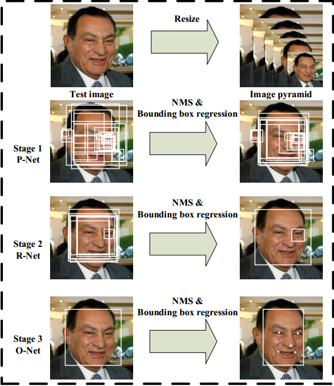
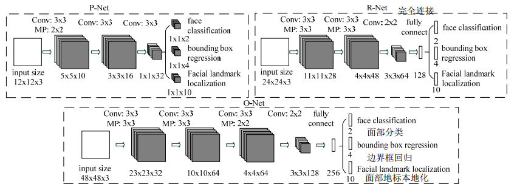
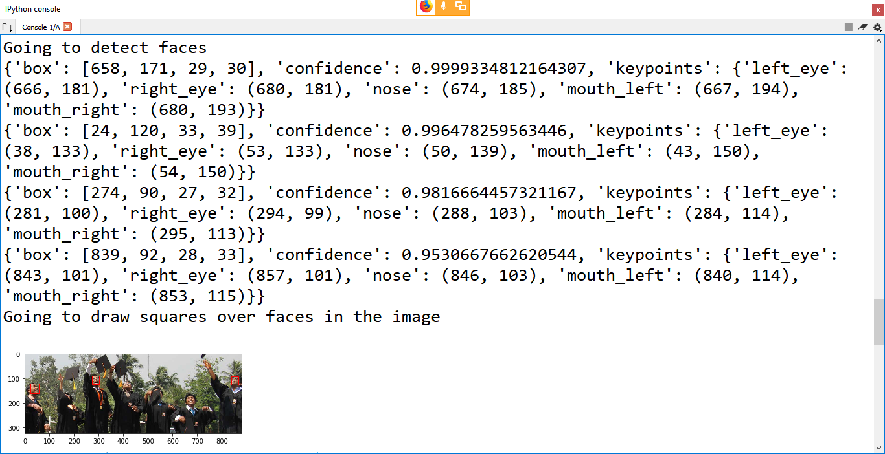
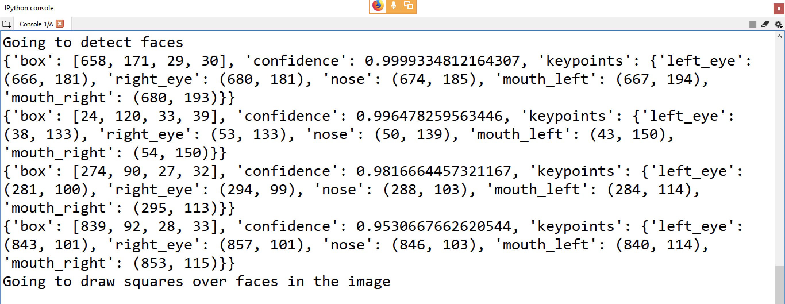

# DeepLearning

## Summary
We perform face detection in python using deep learning model called MTCNN (Multi-task Cascade Convolutional Neural Network).

## Introduction


**Face Decection** is an ever growing and widely applicable branch of Computer Vision and we investigate the in our project how a complex Neural Net can be set up to understand its significance. In the initial stage, we built an Image Recognition Classifier to get acquainted with the deep learning environment in python. The idea was to create a simple Dog/Cat Image classifier to gather a fundamental understandiing of the underlying concepts of a Convolutional Neural Network (CNN) and then go on to applying those concepts to a more complex problem. Our problem is defined by a large-scale more in-depth approach to detecting faces/ multiple faces in photographs, one that is not limited by race, creed, gender, nationality and such. In order to accomplish such a complex, layered task which might prove to be time-consuming as well as challenging, we have chosen the Multi-task Cascade Convolutional Neural Network (or MTCNN for short) and directly applied the model with its pre-trained weights to achieve our desired results.

Convolutional Neural Networks has gained extreme popularity with the remarkable progresses it has achieved in a variety of computer vision tasks, such as image classification and face recognition. Based on such good performances, some of its face detection approaches have become more mainstream in recent years. Deep convolution neural networks for facial detection and recognition perform well, rendering highly accurate responses in recognizing face regions which further help generate an array of candidate faces. Our main intention to rely on MTCNN model is that it has already accounted for some of the bottlenecks in a regular, complex CNN structure. 

First of all, CNNs prove to be time costly in practice. Cascaded CNNs are computationally expensive at incorporating bounding box calibrations for face detections. A fundamental task to enhance face alignment performance using deep CNNs is also under scrutiny. The strength of the face detector is tested in relation to sample mining strategy whereas it's accuracy is improved based on the intial detection windows. MTCNN is a newer, upgraded framework that addresses and resolves some of the aforementioned shortcomings of deep CNNs by integrating those changes. 


## A block diagram

There are three models cascaded into the network (P-net, R-net and O-net) making three stages of prediction: face classification, bounding box regression and facial landmark localization, which is why is it called a Multi-task cascaded convolutional neural network.





**Fig 1:** Pipeline of cascaded framework with the three stages of prediction, each representing a multi-task deep convolutional network. 





**Fig 2:** The architecture of P-Net, R-Net and O-Net, where "MP" means max pooling annd "Conv" means convolution. The step size in convolution and pooling is 1 and 2 respectively.


## Dataset

The dataset for the initial Dog/Cat Image Recognition Classifier was **~8000**. We initially had planned to use a different dataset, i.e Yale Face Database B which is a large dataset (but a biased one) but opted out instead since it didn't embody diverse datapoints as we intended to. As a result, it didn't align with our project goal of detecting people from diverse backgrounds. For our actual problem we eventually decided to use MTCNN and the pre-trained weights and tested it with sample test data. MTCNN internally uses Face Detection Data Set and Benchmark(FDDB), WIDER FACE, and Annotated Facial Landmarks in the Wild(AFLW) benchmark to train the model.


## Input procession / Feature Embedding

For Dog/Cat classifier, the CNN was able to extract the relevant features on the given data and the model was able to distinguish between new Cats and Dogs samples.

Pre-trained weights of MTCNN was used for Face Detection which didn't require any feature extraction.

## Neural Network Architecture

We have used MTCNN that performs joint face detection and alignment and is lightweight and efficient for real time performance. The overall pipeline/schematic of this Neural Network Architecture is outlined in Fig 1. Given an image, it first undergoes data augmentation. It is resized to different scales to build image pyramid, which is fed as the input into the three-stage cascaded framework of MTCNN:

**Stage 1:** Proposal Network (P-net) is a fully convolutional network, the first of the three CNNs that extracts candidate windows and their bounding box regression vectors. It uses the estimated bounding box regression vectors to calibrate the candidates. Non-maximum suppression (NMS) is adopted to merge highly overlapped candidates.

**Stage 2:** All candidates are fed to Refine Network (R-Net), which rejects a large number of false samples, performs calibration with bounding box regression and NMS candidate merge. 

**Stage 3:** This stage is similar to Stage 2 but in this stage, more facial attributes are extracted to describe the face in greater details. The network outputs five facial landmarks' positions.

 The following configuration is used:
 
* 3 x 3 Max Pooling filters
* 3 x 3 Convolution filters

to minimize on some computation that is offset by the depth to increase performance in lesser runtime.

The architecture carries out 3 main processes to train the CNN detectors: Face/non-face classification, bounding box regression and facial mark localization along with auxiliary steps.

1. **Face classification:** This is a two-class classification approach that uses the cross-entropy loss function

2. **Bounding box regression:** For each candidate window, we predict the offset between the window and the nearest bounding boxes' left top, height and width. This is more of a regression problem that adopts Euclidean loss for each sample

3. **Facial landmark localization:** This is formulated as a regression problem where Euclidean loss is minimized between facial landmark coordinates. The five facial landmarks are the left eye, right eye, nose, left mouth corner and right mouth corner

4. **Multi-source training:** Since each CNNs handle different types of training images, i.e face, non-face and partially aligned faces, each net is assigned different values for the task importance

5. **Online hard sampling mining:** This is adopted in comparison to traditional hard sample mining to make the learning process more robust. In each mini-batch, after the computation of the forward propagation phase loss, the top 70% is selected as hard samples. Then gradient from the hard samples is computed in the back propagation. As a result we can rule out the weak samples during training. The result show this strategy yeilds better performance than manual sample selection.

## Results and Discussion

We were able to test our model to find that in each epoch, MTCNN would provide a number of keys for the details of each face detected, including-

1. **Box:** Providing the x, y of the bottom left of the bounding box, as well as the width and height of the box.
2. **Confidence:** The probability confidence of the prediction.
3. **Keypoints:** Providing a dict with dots for the ‘left_eye‘, ‘right_eye‘, ‘nose‘, ‘mouth_left‘, and ‘mouth_right‘.


Thee results below shows the confidence metric with high accuracy along with other details:




**Fig 3:** Detects all the faces in the sample image and prints out a summary for each image detected highlighting coordinates of the box bounding, confidence and the coordinates of the keypoints. 

Overall, the model gave satisfactory outcomes as the model was tested aganist candidates of different ethnicities, samples that represented diversity. However, there were a few exceptions:

The large visual variations of faces, such as occlusions, large pose variations and extreme lightings, impose great challenges for these tasks in real world applications.

* When faces were overshadowed (constrasts\lighting conditions), the model couldn't detect those faces
* If a candidate's eyes are small, the model couldn't detect those faces
* If candidate wears glasses(for e.g candidate in the middle), the reflection on the glasses might meant those faces couldn't be detected
* Candidates with small/ non-visible facial features(such as smaller eyes, noses, mouth) couldn't be outlined by the bounding box as it was difficult to mark facial landmark coordinates

A plausible reason for the face detection to fail for particular subject might arise when the model fails to address two to three off the keypoints (facial landmark localizations). For each of the conditions above, the keypoints detected might've varied giving rise to those problems. We have identified this as one of the leading factors of why certain faces couldn't be . detected/bounded but in order to solve and prove this statistically might require us to work with and modify the core MTCNN algorithm and optimize it to better fit with our expected needs.


## Conclusion & Future Work

In this project, we have implemented MTCNN framework for face detection and alignment.  Our approach with the application of pre-trained weights on sample test set proves to be a light weight method that outperforms the state-of-the-art method while enhancing real-time performance. In the future, we will alter the inherent correlation between face detection and other face  analysis tasks, as mentioned in the discussion above to further improve the performance of the MTCNN model.


## Data and Code Availability

The MTCNN pre-trained weighted model with our test samples successfully generating the results:





Code snippet for testing samples with MTCNN pre-trained weighted models:

```

from matplotlib import pyplot
from matplotlib.patches import Rectangle
import mtcnn
from mtcnn.mtcnn import MTCNN
import cv2

print("MTCNN version:")
print(mtcnn.__version__)

# draw an image with detected objects
def draw_image_with_boxes(filename, result_list):
	# load the image
	data = pyplot.imread(filename)
	# plot the image
	pyplot.imshow(data)
	# get the context for drawing boxes
	ax = pyplot.gca()
	# plot each box
	for result in result_list:
		# get coordinates
		x, y, width, height = result['box']
		# create the shape
		rect = Rectangle((x, y), width, height, fill=False, color='red')
		# draw the box
		ax.add_patch(rect)
	# show the plot
	pyplot.show()


filename = "test1.png"
#filename = "test2.png"
#filename = "test3.png"

print("Going to load the image")
pixels = cv2.imread(filename)
#pixels = pyplot.imread(filename)

print("Going to load mtcnn model with default/pre-trained weights")
detector = MTCNN()

print("Going to detect faces")
faces = detector.detect_faces(pixels)

for face in faces:
    print(face)

print("Going to draw squares over faces in the image")
draw_image_with_boxes(filename, faces)
detector.save("model.h5")


```


1. [MTCNN implementation](https://github.com/ipazc/mtcnn/blob/master/mtcnn/mtcnn.py?fbclid=IwAR2iPpKUK_d4IuxddrJy0gJyOnE_bDl9oYQ_FfZu5hsyy8Fkoh0L4I52lD4)

2. [Cats/Dogs Image Recognition Classifier](https://medium.com/nybles/create-your-first-image-recognition-classifier-using-cnn-keras-and-tensorflow-backend-6eaab98d14dd)

3. [MTCNN with Keras in Python](https://machinelearningmastery.com/how-to-perform-face-detection-with-classical-and-deep-learning-methods-in-python-with-keras/?fbclid=IwAR3vHfYgMPXV-0OwyY78XvcVfmViUeaGYvi0_VcV2M25_kpqB7rHHC5il0g)

## References

1. [Joint Face Detection and Alignment using Multi-task Cascaded Convolutional Networks](https://github.com/ipazc/mtcnn/blob/master/mtcnn/mtcnn.py?fbclid=IwAR2iPpKUK_d4IuxddrJy0gJyOnE_bDl9oYQ_FfZu5hsyy8Fkoh0L4I52lD4)

2. [Multi-task Learning of Cascaded CNN for Facial Attribute Classification](https://github.com/ipazc/mtcnn/blob/master/mtcnn/mtcnn.py?fbclid=IwAR2iPpKUK_d4IuxddrJy0gJyOnE_bDl9oYQ_FfZu5hsyy8Fkoh0L4I52lD4)


